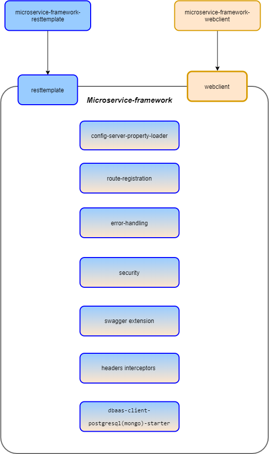

microservice framework library
------------------------------

##### Overview diagram



`Microservice-framework` is a Cloud-Core framework which is intended for rapid development on Spring framework. This framework brings the following functionality out of the box:

* Route registration;
* Config-server property loader;
* Security request policy;
* Security authorization server;
* RestClient (RestTemplate/WebClient) for sending m2m or user secured requests;
* Headers interceptors (Accept-Language, X-Request-Id, Tenant, namespace)
* dbaas-client-postgresql-starter and dbaas-client-mongodb-starter 
* Swagger auth extension

Usage
-----

Microservice-framework can work and offer one of two `restclient`: `resttemplate` or `webclient` and it depends on which artifact you take:
 
 ```xml
     <artifactId>microservice-framework-resttemplate</artifactId>
```
_**Recommendation:** microservice-framework-resttemplate is a deprecated approach and will be deleted in one of the next major release. 
So we strongly recommend to use microservice-framework on WebClient._

or 

```xml
    <artifactId>microservice-framework-webclient</artifactId>
```

Please note that you must not take two artifacts into one module because it will be conflict and your application won't start up, so you need to go for the one.

For more information how to use microservice-framework on resttemplate(deprecated way) you can find in this [readme](./microservice-framework-resttemplate/README.md) and on webclient here [readme](./microservice-framework-webclient/README.md).


